# Meshtastic Lab

Estimated Completion Time: 15 minutes

In this lab you will:

- Learn about the utility of Meshtastic
- Learn about the hardware that is used to implement a Meshtastic Node
- Get hands on experience with using Meshtastic for off-grid communications

## What is Meshtastic?

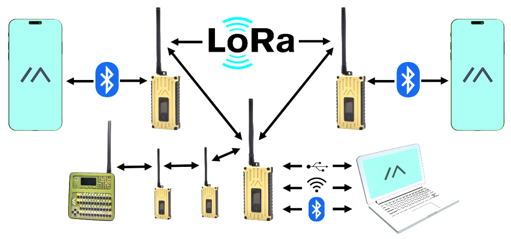

Meshtastic is an open source, off-grid, decentralized, mesh network built to run on affordable, low-power devices. As you can see in the diagram above, Meshtastic can work without relying on cellular or traditional internet service by using a radio frequency communication protocol known as long-range (LoRa) ([ref 1](#resources)). LoRa uses chirp spread spectrum (CSS) modulation to encode data, an advantage of CSS is that it reduces power consumption and increases the range at which data can be received, but the disadvantage is the data rates are not very high.

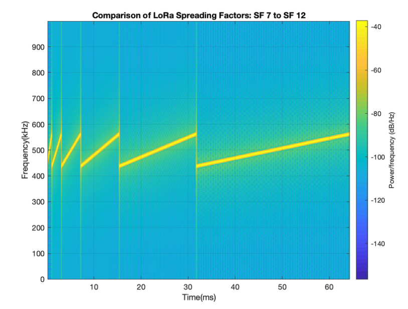 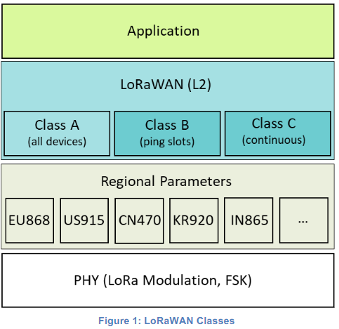

On the left is a visualization of the LoRa modulation scheme as a function of time vs. frequency. On the right is a graphic from the LoRa alliance on the difference between LoRa and LoRa Wide Area Network (LoRaWAN). When we talk about LoRa in this lab, we are strictly referring to the physical layer protocol. Meshtastic does not comply with LoRaWAN because it uses the full spectyrum frequency range per region to enable several hundred possible frequency channels. For examples of LoRaWAN compliant services, see [ref 4](#references).

Meshtastic operates in the US 902-928 MHz industrial scientific and medicine (ISM) band which is free for unlicensed use. These bands vary per country which is why you will see different regional parameters.

## Hardware

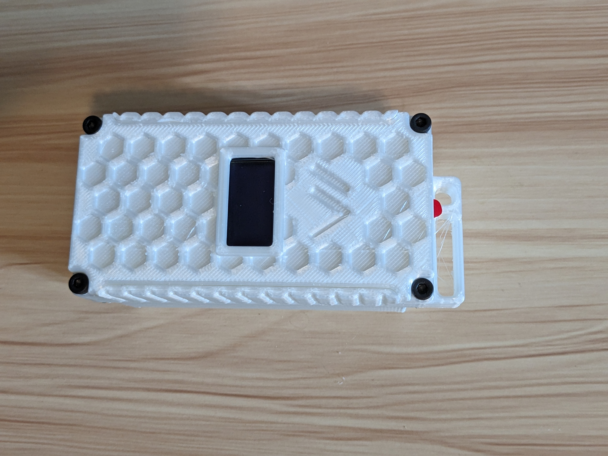 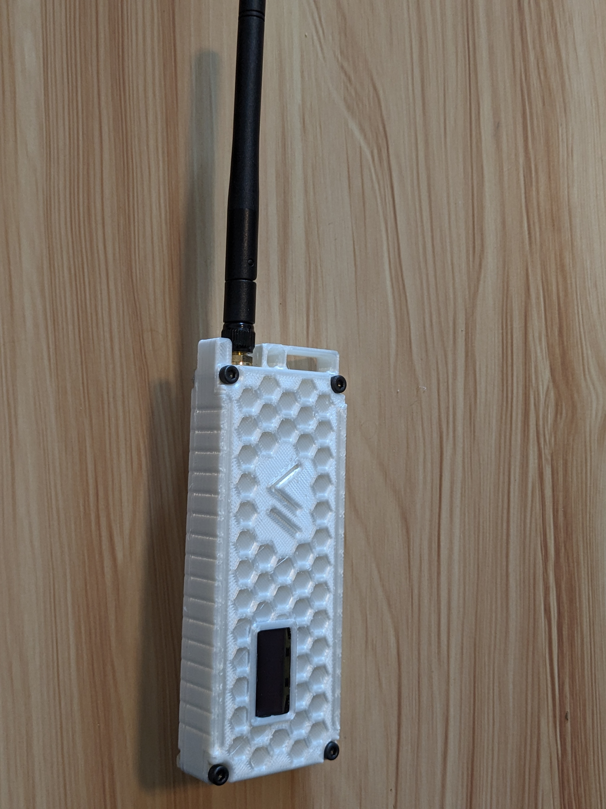

In front of you are two Meshtastic devices. On the left is the Rak WisBlock ([ref 2](#references)) and on the right is the Lilygo T-Beam ([ref 3](#references)). Today, you will use these devices to get an intuitive understanding for how Meshtastic works. Meshtastic is currently built for 3 microcontrollers: the ESP32, nRF52, and RP2040. The Lilygo T-Beam uses the ESP32 while the RAK WisBlock uses the nRF52. Generally, the nRF is preferred when lower power consumption is desired, such as IoT, solar, or handset applications. I've seen a single 18650 3000mAh cell last multiple days with the RAK WisBlock. On the other hand, ESP32 devices require more power but can be lower cost and provide the benefit of WiFi connectivity. The RP2040 is a popular device, but requires a very specific LoRa expansion hat from Waveshare in order to serially communicate over the GPIO pins since Meshtastic does not currently support the Bluetooth feature on the RP2040

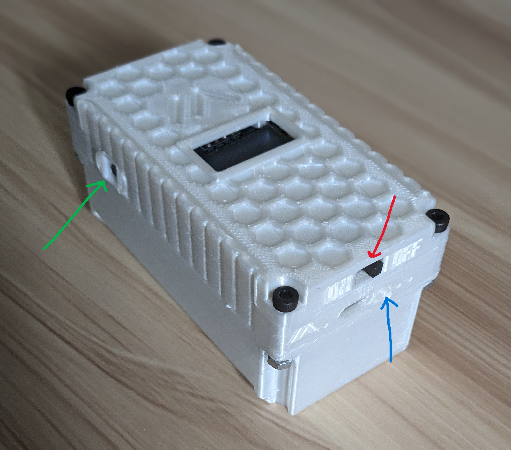 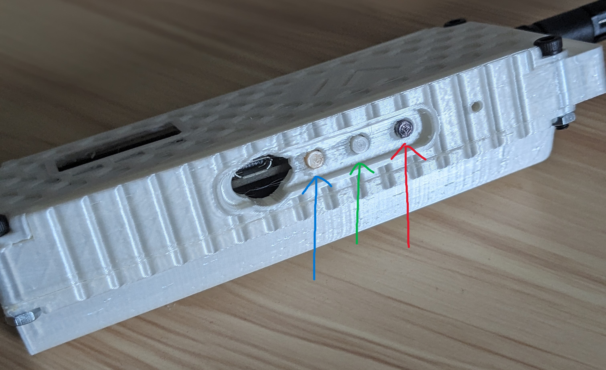

Above you'll see the buttons on each of the devices. For the WisBlock and the T-Beam, the green arrow corresponds to the user button and the blue arrow corresponds to the reset button. On the WisBlock, the red arrow corresponds to "GPS Disable". For the T-Beam, the red arrow corresponds to the power button.

### Total Materials Needed

| Device | Cost | Notes |
|--------|------|-------|
| RAK Meshtastic Starter Kit | $25 | Case not needed |
| LilyGo T-Beam v1.1 | $43 | Case not needed |
| Phone or bluetooth compatible browser | varies | alternatively, you can purchase the LilyGo t-deck for $65 that comes with a keyboard |
| **Total** | $68 | Assuming you have a phone and/or bluetooth compatible browser |

## Usage

Optionally you can follow the instructions in [ref 5](#references) for installing Meshtastic on your device. Alternatively, Meshtastic is installed on the two phones that are in front of you today. Once you have the application installed, follow the procedure below:

1. Launch the Meshtastic Application of your choice. Make sure that Bluetooth is enabled.
2. You will need to pair with the Meshtastic device over Bluetooth before you can use it to communicate. In the settings section of your respective application, add a new connection and pair with either the WisBlock or the T-Beam.

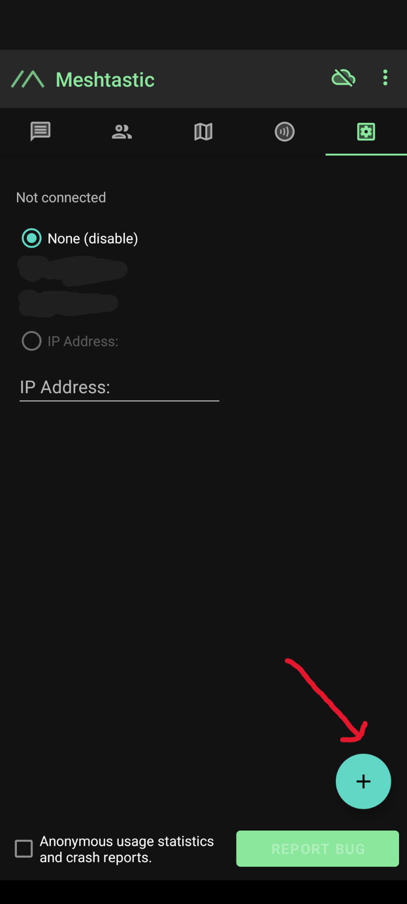 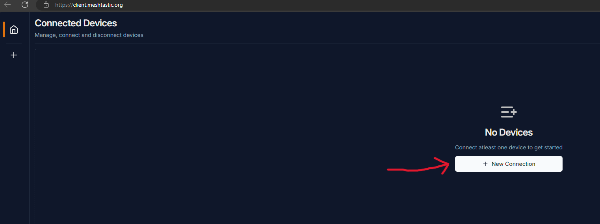

3. Once you've selected the device, you should see a 6 digit number appear on the device's screen. If you don't see the 6 digits, try pressing the user button.
4. After entering the pairing code in the application, the application will begin to load configurations for the device. Once configurations are complete, select the "region" and choose the option for "US". This ensures that Meshtastic will use the 915MHz ISM band that is legal in the US.
5. Repeat steps 1-4 for the other Meshtastic device using a different host device, such as one of the phones we have provided or a laptop with a web client. Once you have two devices configured, proceed on to step 6
6. Navigate to the primary channel, which should be "Long/Fast" and send a message. You should see it appear on the other device. Experiment with getting some distance between devices (don't run away with our devices!)

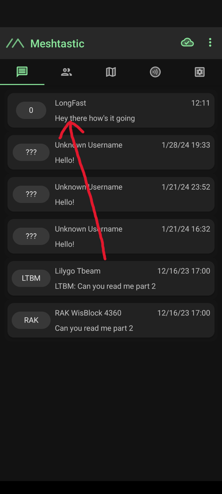 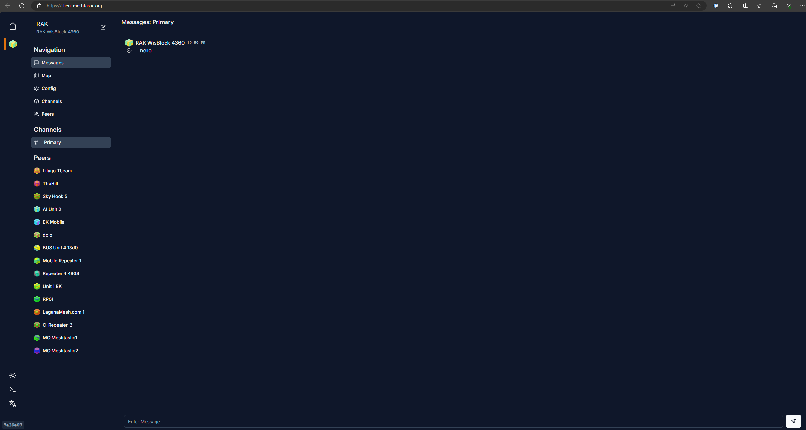

7. Experiment with some different pre-configured channel options. Meshtastic's default is the Long/Fast channel. All of Meshtastic channel names correspond to the link budget and data rate. With link budget, more is better. A good analogy for link budget is the size of a car's gas tank - more gas yields greater distance before refuel. With data rate, more is better as well. However, even with the fastest data rate notice we aren't really breaking any data transfer speed records. This barely beats some of the slower asynchronous serial communication protocols.

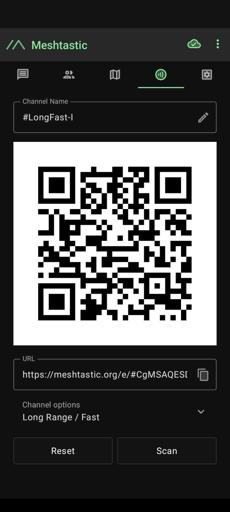 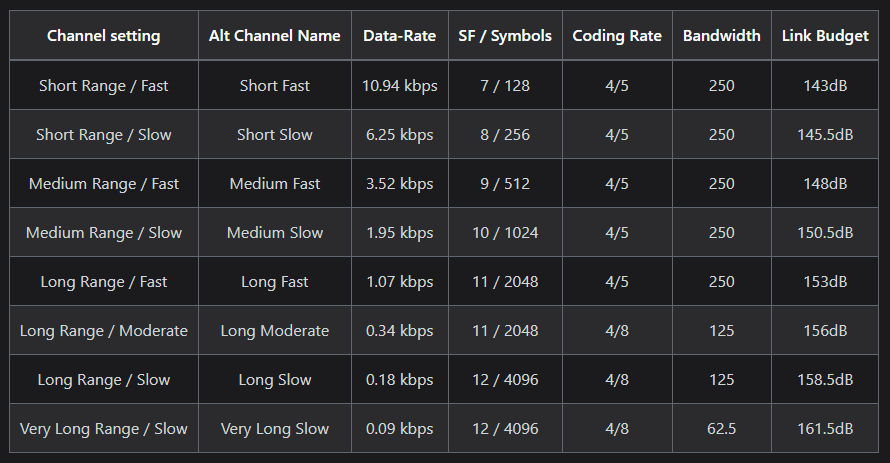

Make sure that you configure both devices for the same channel. Repeat step 6 for the new channel that you configured the devices for.

8. Congratulations! You've completed the Meshtastic lab. To make sure that the users after you have the same experience, please navigate to the 3 dots in the upper right of the phone app and select "Radio Configuration". In this menu, scroll to the bottom and select "Factory Reset" and send to the device. Do this on both devices that you've used - there is no option to factory reset from the web client.

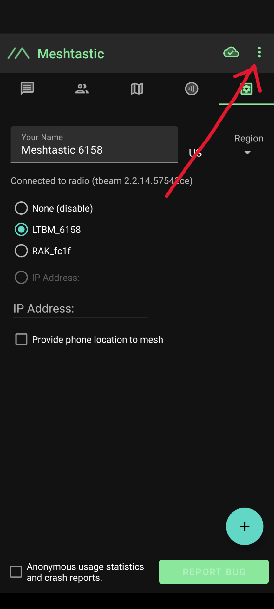 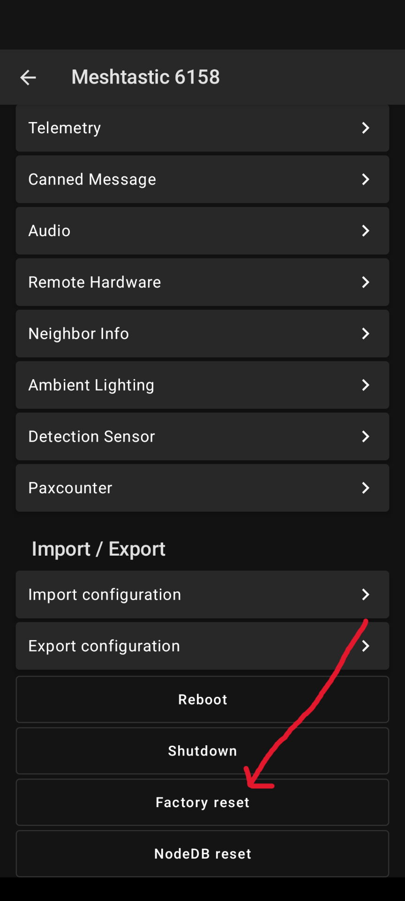

## References

1. Learn more about LoRa and LoRaWAN from the LoRa Alliance: https://lora-alliance.org/
2. Buy a RAK WisBlock Meshtastic Starter Kit: https://store.rakwireless.com/products/wisblock-meshtastic-starter-kit
3. Buy a Lilygo T-Beam Meshtastic Board: https://store.rokland.com/products/lilygo-t-beam-v1-1-neo-m8n-gnss-ipex-lora-sx1262-915mhz-wireless-module-wifi-bluetooth-board-q215?ref=8Bb2mUO5i-jKwt
4. LoRaWAN Examples
    - The Things Network: https://www.thethingsnetwork.org/
    - Helium: https://www.helium.com/
5. Installing Meshtastic:
    - Android App: https://meshtastic.org/docs/software/android/installation/
    - Apple Store: https://apps.apple.com/us/app/meshtastic/id1586432531?ign-itscg=30200&ign-itsct=apps_box_promote_link
    - Web App: https://client.meshtastic.org/
6. Meshtastic Documentation: https://meshtastic.org/
7. Andreas Spiess building a 3 node Meshtastic Network: https://youtu.be/EAQI2ZSmxPU?si=sl6xw3_UPc8nE8CY
8. Map of Meshtastic Nodes connected to the public MQTT server: https://map.technicallyrural.com/
9. The Comms Channel on YouTube has some good Meshtastic content: https://www.youtube.com/@The_Comms_Channel/videos
10. Organization building a Meshtastic Network in Laguna Beach, CA: https://lagunamesh.com/